## PyTorch 2.0 benchmark
[PyTorch 2.0](https://pytorch.org/get-started/pytorch-2.0/#requirements) is out, let's see how fast is 1torch.compile1`. 

**code is [here](https://github.com/FrancescoSaverioZuppichini/pytorch-2.0-benchmark)**

**I am using `torch==2.1.0`

If you think I've done something wrong, please PR 🙏


## TL;DR

Yes, it makes **inference** faster by around `22%`.

I still need to test it during training, but I think it will be similar.

## My Env
I am using a **RTX 3090**

Running 

```
wget https://raw.githubusercontent.com/pytorch/pytorch/master/torch/utils/collect_env.py
python collect_env.py
```

Results in the logs in [this txt file](my_env.txt)


## Running the benchmark
The whole benchmark code is in [`main.py`](main.py)

### For lazy people

If you have already your stuff in an env in python, you can follow the [PyTorch 2.0 installation guide](https://pytorch.org/get-started/pytorch-2.0/)

Be sure to install the requirements

```
pip install -r requirements.txt
```

Then

```
chmod +x ./run_benchmarks.sh && ./run_benchmarks.sh
```

Results will be stored in `results/results.csv`

### For JEDIs

I have a `Dockerfile`. I have checked it matches the results run on my sistem **directly**. 


Build docker image with torch 2.1

```
docker build -t torch-2.1-benchmark . 
```  

and run this stuff

```
docker run --gpus all --rm -it --ipc=host --shm-size 64g -v $(pwd):/workspace torch-2.1-benchmark
```

Then inside

```
chmod +x ./run_benchmarks.sh && ./run_benchmarks.sh
```

Results will be stored in `results/results.csv`

## Setup

We will use several models, mostly different ViTs from OpenAI CLIP. We won't use models from timm or hugging face since for ViTs they don't use `torch.nn.MultiHeadAttention`, so they are slower by default in inference. In addition, we will use the good and old `resnet34`. `convetnext-base` seems to break `torch.compile`, see [issue](https://github.com/pytorch/pytorch/issues/97018)

Specifically, are running **five models**: `resnet34`, `resnext50_32x4d`, `clip_vision_vit-b/32`, ,`clip_vision_vit-l/14, and `clip_vision_vit-rn50` with `batch_sizes` of `(1 4 8 16 32 64)` on `image_size=224x224`.  For the conv nets, we are also running with `image_size=640`.

I am compiling the models with `model = torch.compile(model, mode="max-autotune")`, to see the best performance we can get. It takes a couple of minutes depending on the model itself.

I am using torch torch.utils.benchmark.Timer` to benchmark each run.

## Results
### Torch 2.0 vs Torch.2.0 compile

[Table with results](results/torch-torch2-compile.md)


| model name | image | image_size |
| --- | --- | --- |
| resnet34 | 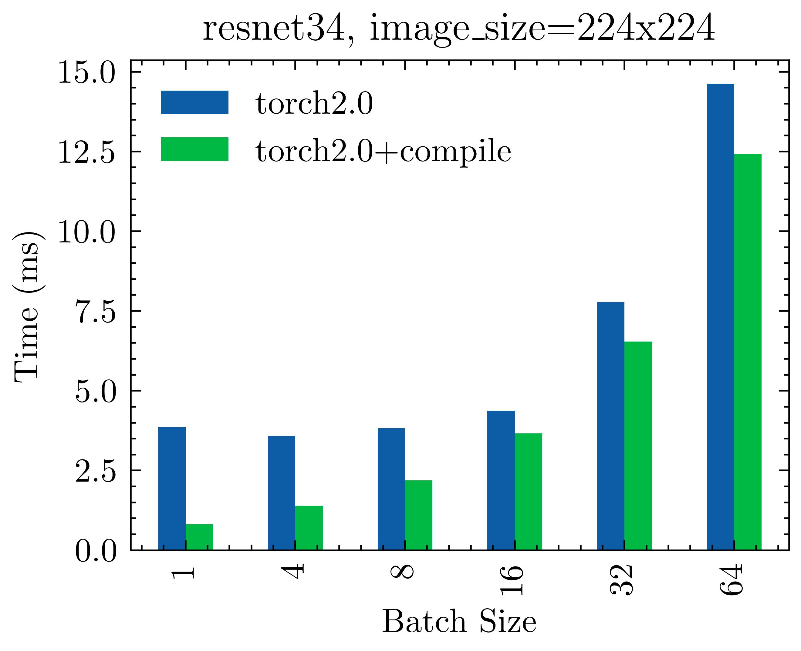 | 224 |
| resnet34 | 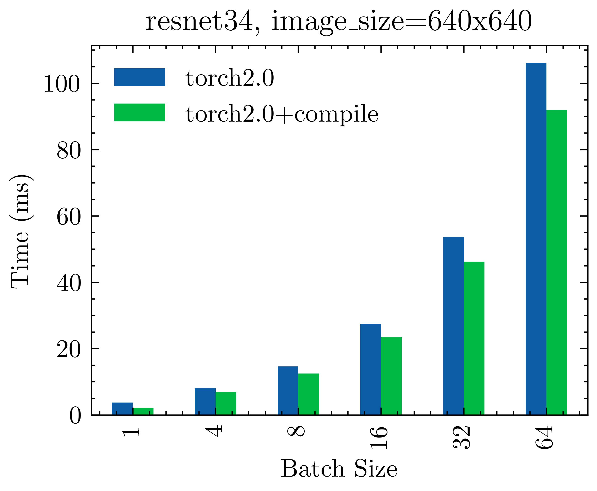 | 640 |
| resnext50_32x4d | 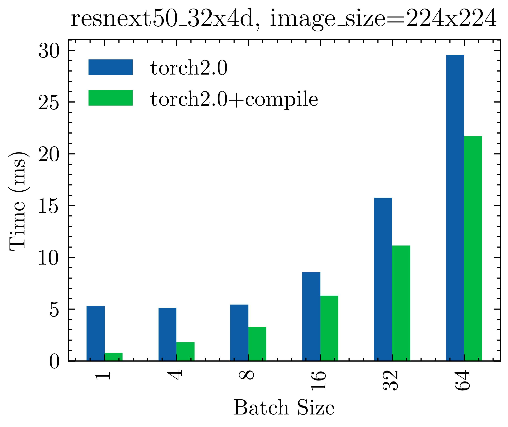  |  224 |
| resnext50_32x4d | 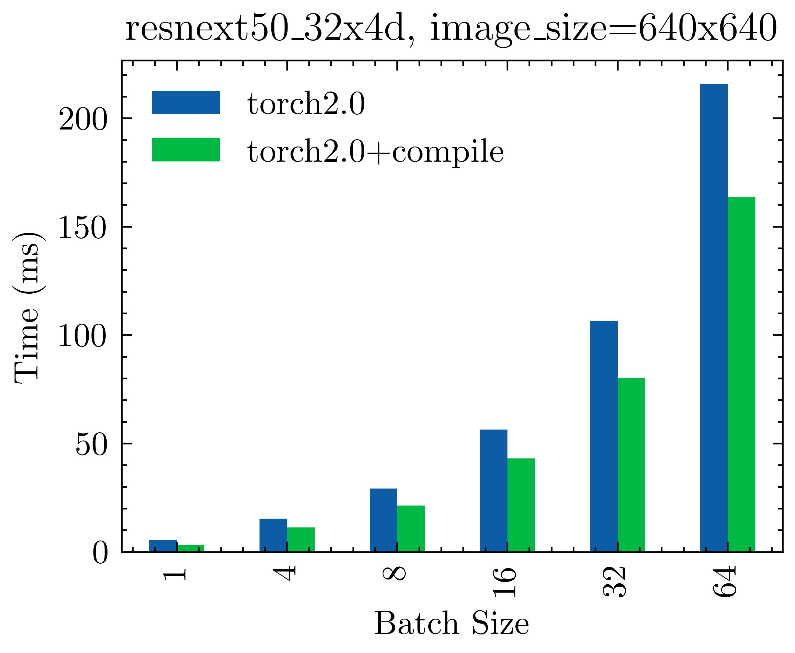  |  640 |
| clip_vision_vit-b/32 | 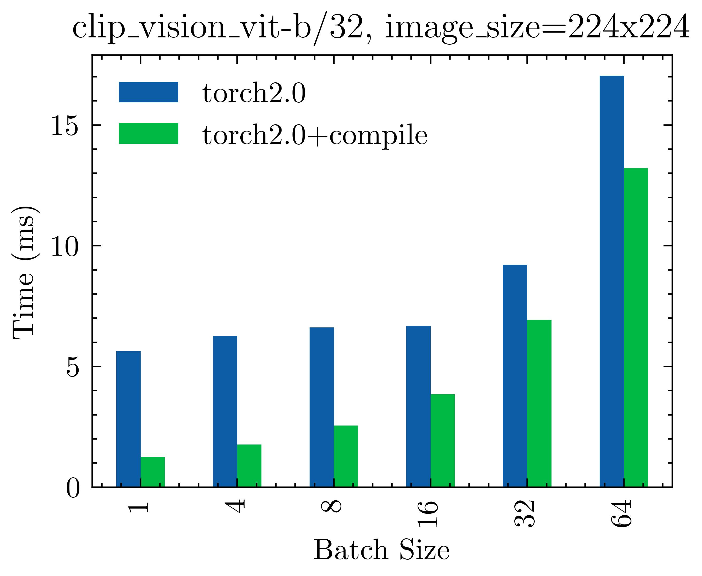  |  224 |
| clip_vision_vit-l/14 |  | 224 |
| clip_vision_vit-rn50 | 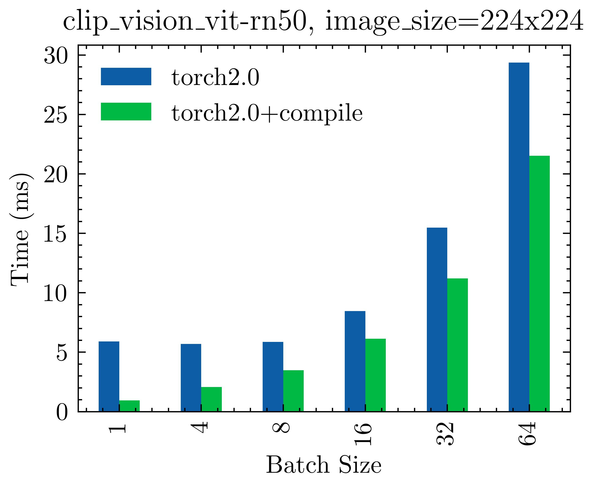 | 224 |

### Torch 2.0 vs cudnn.benchmark=True
I've also run everything with and without `torch.backends.cudnn.benchmark = True`
[Table with results](results/torch-cudnn_benchmark.md)

| model name | image | image_size |
| --- | --- | --- |
| resnet34 | 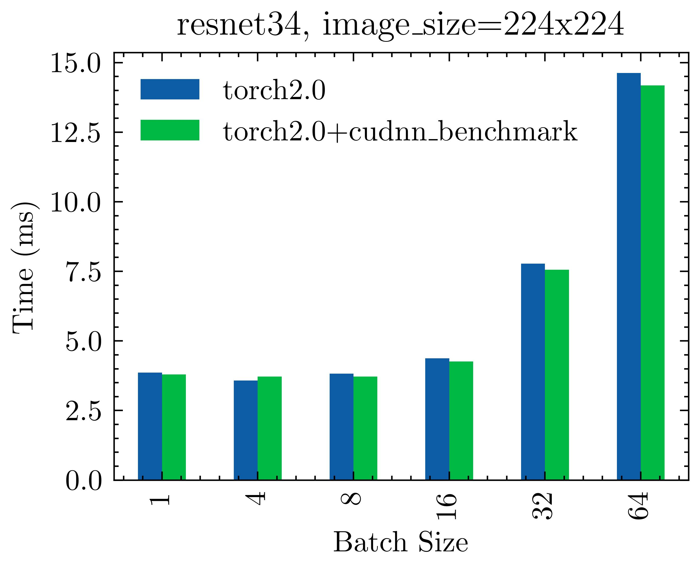 | 224 |
| resnet34 | 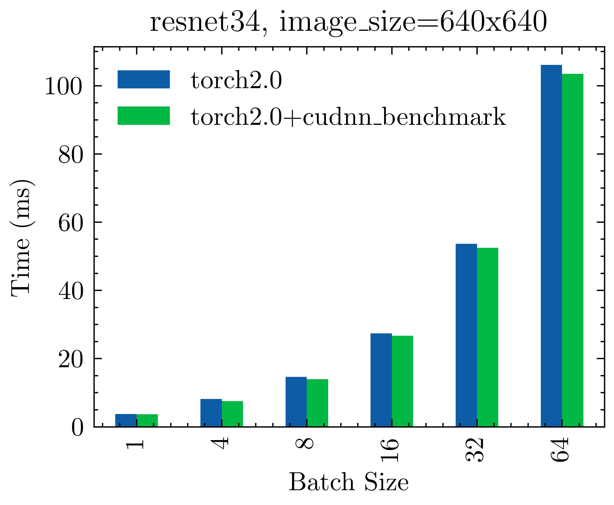 | 640 |
| resnext50_32x4d | 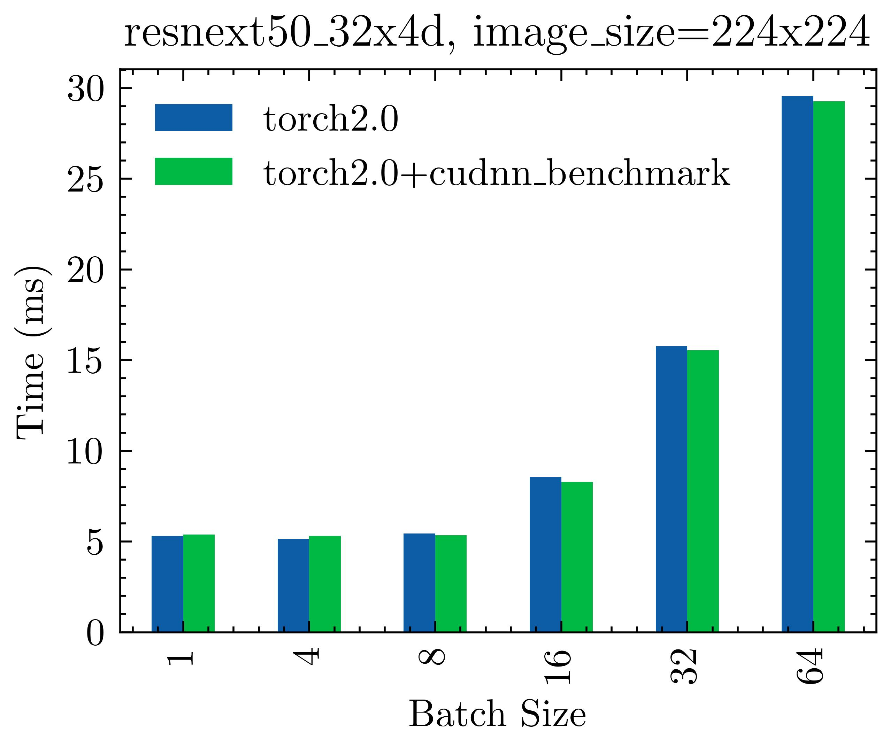  |  224 |
| resnext50_32x4d | 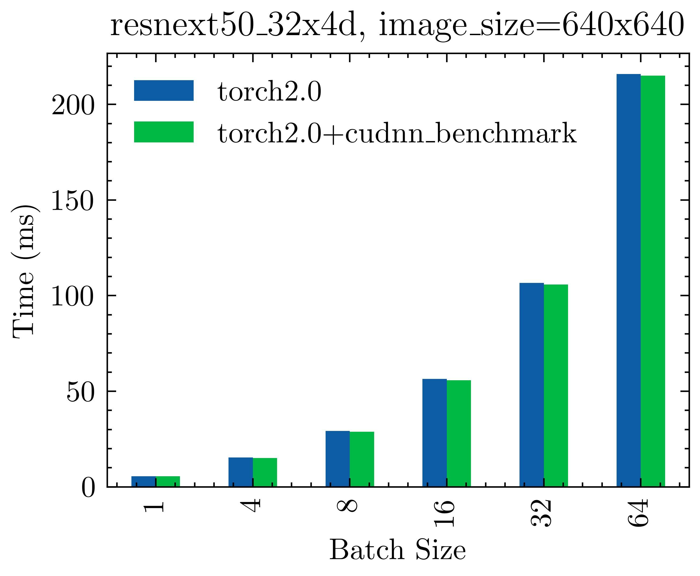  |  640 |
| clip_vision_vit-b/32 | 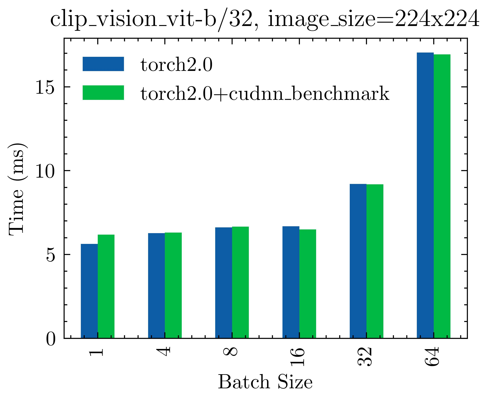  |  224 |
| clip_vision_vit-l/14 |  | 224 |
| clip_vision_vit-rn50 |  | 224 |

For some reason, the last two images were not generated. I had 

```
raceback (most recent call last):
  File "/home/zuppif/Documents/medium/pytorch-2.0-compile/make_plots.py", line 93, in <module>
    make_plots_for_torch_vs_cudnn_benchmark()
  File "/home/zuppif/Documents/medium/pytorch-2.0-compile/make_plots.py", line 75, in make_plots_for_torch_vs_cudnn_benchmark
    ax = plot_df.plot(y=["torch2.0", "torch2.0+cudnn_benchmark"], kind="bar")
  File "/home/zuppif/miniconda3/envs/dl/lib/python3.9/site-packages/pandas/plotting/_core.py", line 972, in __call__
    return plot_backend.plot(data, kind=kind, **kwargs)
  File "/home/zuppif/miniconda3/envs/dl/lib/python3.9/site-packages/pandas/plotting/_matplotlib/__init__.py", line 71, in plot
    plot_obj.generate()
  File "/home/zuppif/miniconda3/envs/dl/lib/python3.9/site-packages/pandas/plotting/_matplotlib/core.py", line 295, in generate
    self._post_plot_logic(ax, self.data)
  File "/home/zuppif/miniconda3/envs/dl/lib/python3.9/site-packages/pandas/plotting/_matplotlib/core.py", line 1528, in _post_plot_logic
    s_edge = self.ax_pos[0] - 0.25 + self.lim_offset
IndexError: index 0 is out of bounds for axis 0 with size 0
```