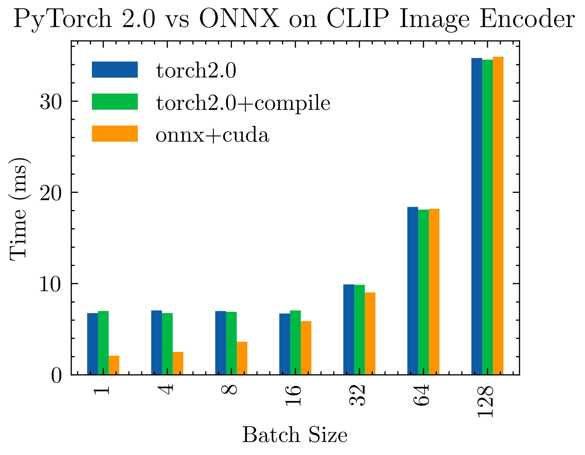

# PyTorch 2.0 benchmark

> **Warning**
> ONNX seems to be running on float16 like it should be but I am not 100% sure

[PyTorch 2.0](https://pytorch.org/get-started/pytorch-2.0/#requirements) is out, let's see how fast is `torch.compile`. We will use OpenaAI Clip since it's a very used model and **they have an jit version** so I can run it in onnx.

If you think I've done something wrong, please PR 🙏



**TL;DR** `torch.compile doesn't do anything and onnx is slower` 

|   batch_size |   torch2.0 |   torch2.0+compile |   onnx+cuda |
|-------------:|-----------:|-------------------:|------------:|
|            1 |    6.76655 |            6.99293 |     2.11856 |
|            4 |    7.07333 |            6.7641  |     2.51977 |
|            8 |    7.00146 |            6.91623 |     3.63718 |
|           16 |    6.72239 |            7.07157 |     5.89697 |
|           32 |    9.91361 |            9.88104 |     9.03549 |
|           64 |   18.4069  |           18.1073  |    18.2092  |
|          128 |   34.7111  |           34.538   |    34.8507  |


All numbers in `ms`. A more detailed table (generated by the benchmark) can be found at `result.csv`

> **Note**
> Tested on a GTX 3090

Running inside the container

```bash
wget https://raw.githubusercontent.com/pytorch/pytorch/master/torch/utils/collect_env.py
python collect_env.py
```

```
Collecting environment information...
PyTorch version: 1.14.0.dev20221202
Is debug build: False
CUDA used to build PyTorch: 11.6
ROCM used to build PyTorch: N/A

OS: Ubuntu 18.04.6 LTS (x86_64)
GCC version: Could not collect
Clang version: Could not collect
CMake version: version 3.25.0
Libc version: glibc-2.27

Python version: 3.10.8 (main, Nov  4 2022, 13:48:29) [GCC 11.2.0] (64-bit runtime)
Python platform: Linux-5.19.0-26-generic-x86_64-with-glibc2.27
Is CUDA available: True
CUDA runtime version: 11.6.124
CUDA_MODULE_LOADING set to: LAZY
GPU models and configuration: GPU 0: NVIDIA GeForce RTX 3090
Nvidia driver version: 515.76
cuDNN version: Could not collect
HIP runtime version: N/A
MIOpen runtime version: N/A
Is XNNPACK available: True

Versions of relevant libraries:
[pip3] numpy==1.22.3
[pip3] torch==1.14.0.dev20221202
[pip3] torchdata==0.6.0.dev20221202
[pip3] torchelastic==0.2.2
[pip3] torchtext==0.15.0.dev20221202
[pip3] torchtriton==2.0.0+0d7e753227
[pip3] torchvision==0.15.0.dev20221202
[conda] blas                      1.0                         mkl  
[conda] mkl                       2021.4.0           h06a4308_640  
[conda] mkl-service               2.4.0           py310h7f8727e_0  
[conda] mkl_fft                   1.3.1           py310hd6ae3a3_0  
[conda] mkl_random                1.2.2           py310h00e6091_0  
[conda] numpy                     1.22.3          py310hfa59a62_0  
[conda] numpy-base                1.22.3          py310h9585f30_0  
[conda] pytorch                   1.14.0.dev20221202 py3.10_cuda11.6_cudnn8.3.2_0    pytorch-nightly
[conda] pytorch-cuda              11.6                 h867d48c_0    pytorch-nightly
[conda] pytorch-mutex             1.0                        cuda    pytorch-nightly
[conda] torchdata                 0.6.0.dev20221202           py310    pytorch-nightly
[conda] torchelastic              0.2.2                    pypi_0    pypi
[conda] torchtext                 0.15.0.dev20221202           py310    pytorch-nightly
[conda] torchtriton               2.0.0+0d7e753227          pypi_0    pypi
[conda] torchvision               0.15.0.dev20221202     py310_cu116    pytorch-nightly
````

## Running the benchmark

First, export Clip to onnx


```bash
python src/clip_export_onnx.py
```

Model will be saved as `ViT-B/32.onnx`

I've original tried to used [sclale](https://github.com/plasma-umass/scalene) but on GPU it doesn't work, it explodes randomly. So I only recorded speed with python directly

then, build docker image with `torch 2.0`

```bash
docker build -t torch-2.0-benchmark .   
```

and run this shit

```bash 
docker run --gpus all --rm -it --ipc=host --shm-size 64g -v $(pwd):/workspace torch-2.0-benchmark
```

Then inside

```bash
python src/main.py
```

Results will be stored in `results.csv`